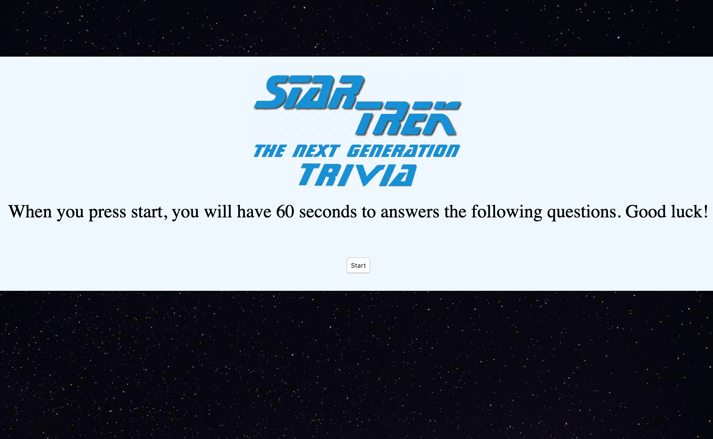

# TriviaGame

<h2> <a href="https://ogilvie1231.github.io/TriviaGame/">Play the Star Trek Trivia Game</a></h2>
<!--  -->
&nbsp;

<h2>How it works</h2>

Test your Star Trek The Next Generation knowledge. Once you press start you will have 60 seconds to complete the quiz. Once you finish you will be taken to the end page which will display your results. If you do not finish in time the questions you were unable to answer will be counted as unanswered. Don't worry, if you don't complete it the first time you can simply click "Start" to try again.

Built using HTML, CSS, JavaScript and jQuery

